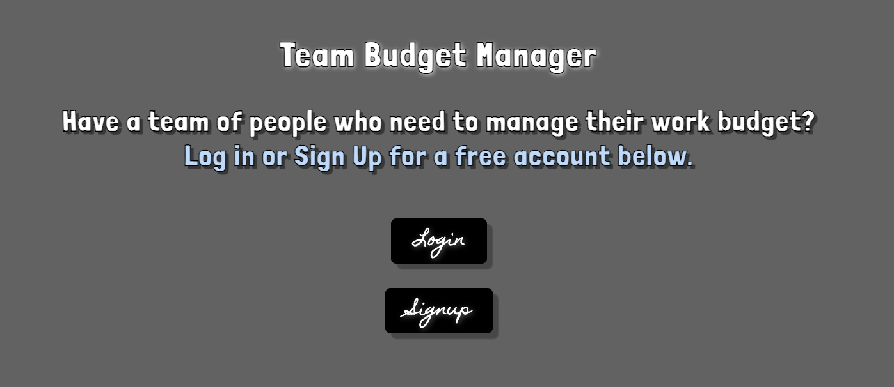
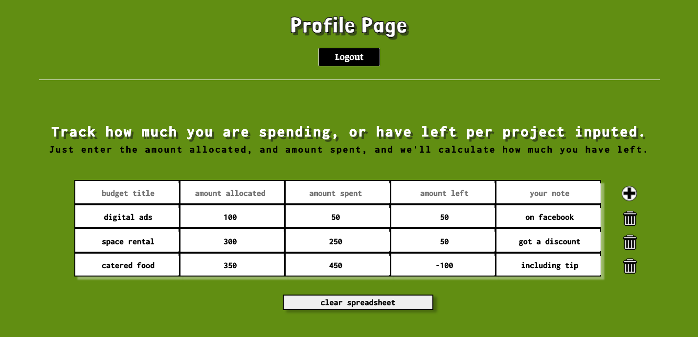

## Goal
Create a fullstack team Budget App with User Login where team members can track how much of their budget they have left per project. 

## How it's made
Made using CSS, Javascript, Node.js, JSON, Express, EJS, MongoDB, Mongoose, and User Authentification using passport.

## Lessons learned
Was able to come back and make all the changes and upgrades I wanted - like creating a calculator within the spreadsheet.
